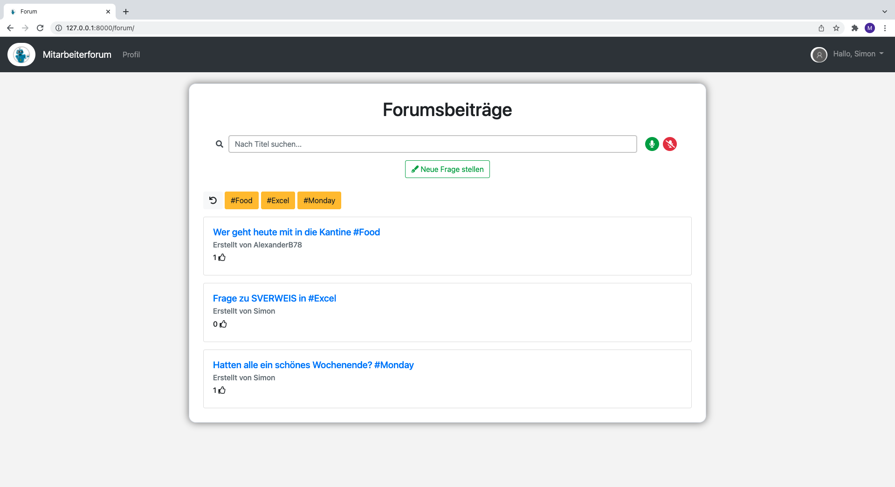

# Programmier_Seminar

### :computer: Programmierprojekt - Mitarbeiterforum mit Django und Python

##### Mitarbeiterforum Bild:

##### Funktionalitäten: 
* Neuen Mitarbeiter registrieren 
* Als Mitarbeiter einloggen
* Impressum
* Forum Seite
* Frage posten
* Auf Fragen antworten und unterkommentare posten
* Benutzerprofil ändern und updaten

##### Nutzen des GitHub Codes:
1. Visual Studio Code öffnen
2. Zur Quellcodeverwaltung navigieren
3. Wenn noch nicht mit einem GitHub Account eingeloggt, dies nun tun 4. Repository klonen drücken
5. Aus GitHub klonen drücken
6. Maurice73/Tech/Programmier_Seminar auswählen und klonen

##### Terminal Befehle:
| Befehl Beschreibung | Windows Terminal Befehl | MacOS, Linux Terminal Befehl |
| ------------------- | ----------------------- | ---------------------------- |
| Virtuelle Environment erstellen | /> python -m venv virt /> source virt/Scripts/activate | $ python3 -m venv virt $ source virt/bin/activate|
| Django installieren | /> py -m pip install Django | $ python3 -m pip install Django |
| Start Django Project | /> django-admin startproject djangoGlobal | $ django-admin startproject djangoGlobal |
| Verzeichnis (Directory) wechseln | /> cd | $ cd |
| Server migraten | /> python manage.py migrate | $ python3 manage.py migrate |
| Server starten | /> python manage.py runserver | $ python3 manage.py runserver |
| Superuser anlegen | /> (winpty) python manage.py createsuperuser | $ python3 manage.py createsuperuser |

###### Anbindung von PostgreSQL:
1. Downloaden von PostgreSQL unter: https://www.postgresql.org/download/ 
2. Haken bei Stack Builder entfernen
3. Als Passwort: Start123 festlegen
4. Als Port: 5433 festlegen
5. Installation abschließen
6. Installierte PostgreSQL Applikation öffnen
7. Neue Datenbank mit dem Namen: app_db erstellen
8. In Visual Studio Code migraten
9. Alle erforderlichen pip Installationen machen und neueste pip Version installieren 

##### Pip install requirements:
* asgiref==3.4.1
* Django==3.2.8
* django-ckeditor==6.2.0
* django-js-asset==1.2.2
* Pillow==8.4.0
* psycopg2==2.9.2
* pytz==2021.3
* sqlparse==0.4.2

##### Genutzte Technologien: 
* Django/Python
* HTML, CSS, JavaScript
* Bootstrap 5
* Google Webspeech API
* PostgreSQL